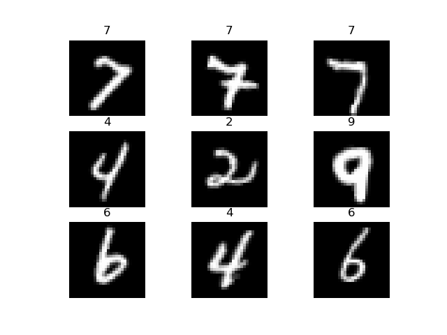
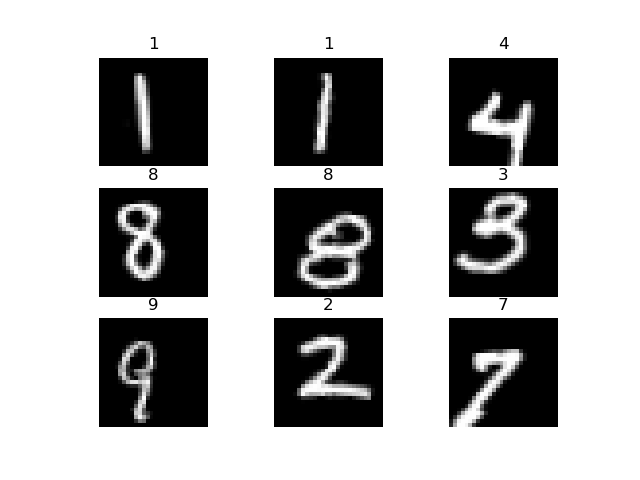
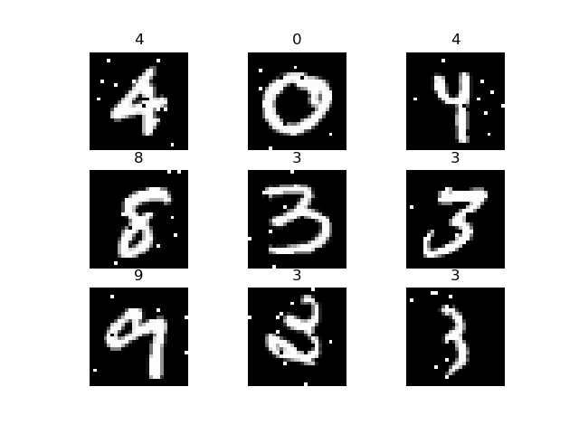
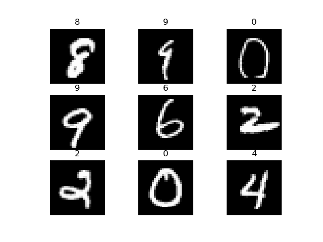
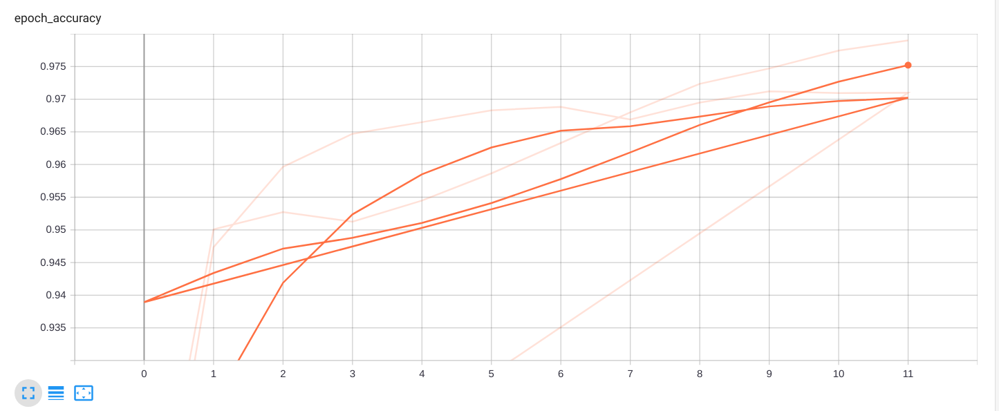

# AutomatedTesting2020

* 姓名：庄子元
* 学号：181830266
* 选题方向：AI自动化测试 Data Augmentation

## Introduction

模型通过数据增强提升神经网络的泛化性能。神经网络具有大量的参数，针对复杂神经网络的训练需要更多的样本数据，以完成训练。如果模型欠拟合，预测效果会非常差。此外，神经网络最大的难题就是过拟合问题，网络学到错误的特征，作出错误的预测。

数据增强(Data Augmentation)是解决以上问题的较好方法。通过对数据进行空间几何变换（翻转，裁减，旋转，变形，仿射变换，透射变换，分段仿射）、像素颜色变换（添加噪声，模糊图像，随机擦除，颜色通道转换）、多样本合成、特征提取生成（GAN）等方法，数据增强可以提升数据集的复杂度，可以理解为数据增强方法增加了训练集的大小，降低模型的过拟合程度。

由于算力有限，神仙助教姐姐/哥哥不给白嫖计算资源，因此本次实验主要在MNIST数据集上进行分析和验证，最后用CIFAR100数据集进行测试。模型分析部分主要讲了所给几个模型的参数和类型，以及相关存在的问题；实验验证部分，主要是测试了数据增强后，原有模型是否能够成功识别，增强数据的训练能否提升模型性能。个人感想阐述了这次大作业的心得体会和踩的一些坑。

## 模型分析

本实验在MNIST和CIFAR100目标检测数据集上开展。本节主要分析MNIST和CIFAR100数据集中用到的模型。

### 模型结构

本次实验中，MNIST数据集主要使用的模型结构有DNN, LeNet5, Random, VGG16等。CIFAR100数据集主要使用的有CNN，LeNet, Random, ResNet等网络。

#### MNIST

MNIST共计8个模型，由是否dropout分为两类，由于Dropout方法主要是用于缓解过拟合，为了让实验结果更加显著，我们主要用非Dropout方法进行验证。

利用keras的model.summary()方法，我们可以轻松的看到模型内部结构。

1. 随机神经网络只有一个全连接层，结合测试结果易知它是欠训练的，也必定会欠训练。
2. LeNet5网络出自1998年Yann LeCun的论文*Gradient-Based Learning Applied to Document Recognition*，是首个成功的CNN网络，在实验验证中也达到了98%的准确率，效果较好。
3. DNN深度神经网络是目前图像识别中效果较好的网络，本实验提供的DNN中有150W的参数需要训练，有很好的性能，但也更加容易出现过拟合现象。
4. VGG网络这样Very Deep Convolutional Networks拥有16层2800万参数，容易产生梯度BP消失等问题，非常难以训练，由于他超强的学习力，极容易发生过拟合现象。

#### CIFAR100

CIFAR100数据集分为Dropout与否两类，主要是CNN, LeNet, Random和ResNet。

1. Random网络各有30W个参数，但是很迷惑它只有一个全连接层，四舍五入就是线性的，效果较差，    训练了10个epoch也只有1%的准确率
2. CNN就是非常经典的神经网络(图像识别yyds)，有130万参数
3. LeNet5 虽然模型的名字叫lenet5，但他只有4个隐层，有300W个参数
4. ResNet依靠深度和残差学习的机制让CNN提升了一级，两个版本分别有28W和86W参数要训练

### 运行步骤

```py
keras.model.load_model(model_path)
model.compile(optimizer='adam', loss='sparse_categorical_crossentropy', metrics=['accuracy'])
model.fit() # 训练的时候
model.evaluate(X_test, y_test) # 默认batch的大小是32所以测试数量我都是313
```

### 相关参考文献

[1] Shorten, C., Khoshgoftaar, T.M. A survey on Image Data Augmentation for Deep Learning. J Big Data 6, 60 (2019). https://doi.org/10.1186/s40537-019-0197-0
[2] Zhong, Zhun & Zheng, Liang & Kang, Guoliang & Li, Shaozi & Yang, Yi. (2017). Random Erasing Data Augmentation. Proceedings of the AAAI Conference on Artificial Intelligence. 34. 10.1609/aaai.v34i07.7000.

## Experiment

本次实验扩增是基于MNIST数据集和CIFAR100数据集，对所给的神经网络进行攻击。扩增方法主要是keras已有的ImageDataGen方法，结合提供的preprocessing_function自定义函数进行扩增。

### MNIST扩增

MNIST是一个单通道28*28的手写数字数据集。由于数字有天然的方向性和结构，为了保证标签不发生变化，我们对MNIST的扩增需要在一定的范围限度内。又局限于他的单通道特性和时neng间li有限，对MNIST主要采用几何变化来数据扩增。

#### 旋转，Rotate

根据相关论文，对MNIST数据集在20°范围内进行旋转是安全的，这里我们选用了15°的范围，用rotation_range参数对图像进行一小部分的旋转。



#### 仿射变换，Scale

对图像进行压缩和新编，width_shift_range和height_shift_range方法为我们提供了可行的轮子。



#### 像素变换，Pepper

为图像加入椒盐噪声，增加对噪声的鲁棒性能



#### 正则变换 Wrap

这是自己倒腾的一个方法。要让图像扭曲，需要一个扭曲函数。已有的方法例如分段仿射，是将图片分成几段后，对每一段进行一个随机程度和方向的仿射变换，类似为图像抖动。可以理解为，使用一个在值域[-1,1]之间的一个随机点函数作为扭曲函数。但是这样的抖动容易让MNIST这样的连续性数据点变的离散，因此我们需要用连续函数对图像进行扭曲。

通过对手写数字进行分析可知，数字图像一般位于图片中心，手写的起始点和终止点差距较大，核心形状是类似的。我们这里采用正则函数，随机生成一个扭曲值，使得图像在四周偏移程度大，重心偏移程度小，以生成更多的测试数据集。

数学的表述来说，正则变换的公式是

$$R_w = R_0+\alpha u$$

其中$R_w$是warp变换后的坐标，$R_0$是初始坐标，$\alpha$是仿射变换的程度，一般设置为2，$u$是正则坐标变换向量，由二维正态分布计算得出。



```py
def wrap(img: np.ndarray, alpha=2):
    n_img = np.full([28, 28, 1], 254.)
    alpha = alpha * random.random()
    for i in range(28):
        for j in range(28):
            offset_x = int(alpha * (norm[i]-0.5))
            offset_y = int(alpha * (norm[i]-0.5))
            if i+offset_y < 28 and j+offset_x < 28:
                n_img[i, j] = img[(i+offset_y), (j+offset_x)]
    return n_img
```

### MNIST验证

在MNIST数据集上，使用原始测试集(origin)和不同扩增方法下的测试数据集的准确率分别如下：

|          模型          | origin | Rotate | Scale  | Pepper |  Wrap  | Wrap+Rotate |
| :--------------------: | :----: | :----: | :----: | :----: | :----: | :---------: |
|    dnn_with_dropout    | 0.9805 | 0.9577 | 0.5037 | 0.9677 | 0.9601 |   0.9466    |
|  dnn_without_dropout   | 0.9743 | 0.8949 | 0.4354 | 0.9047 | 0.8824 |   0.8611    |
|  lenet5_with_dropout   | 0.9872 | 0.9800 | 0.6648 | 0.9872 | 0.9836 |   0.9752    |
| lenet5_without_dropout | 0.9878 | 0.9784 | 0.6706 | 0.9844 | 0.9815 |   0.9742    |
|     random1_mnist      | 0.1461 | 0.1320 | 0.1164 | 0.1332 | 0.1369 |   0.1360    |
|     ramdom2_mnist      | 0.3500 | 0.3400 | 0.1756 | 0.3285 | 0.3378 |   0.3314    |
|   vgg16_with_dropout   | 0.9889 | 0.9808 | 0.8117 | 0.9856 | 0.9792 |   0.9698    |
| vgg16_without_dropout  | 0.9862 | 0.9772 | 0.7613 | 0.9829 | 0.9771 |   0.9682    |

分析可以发现，自己发xia明bian的正态变换(wrap)在某种程度上降低了模型的预测准确度，尤其是对于没有使用dropout方法提高泛化能力的神经网络来说，造成准确度的影响要大于with_dropout方法，这个现象在DNN上最为明显。此外，虽然用Scale方法生成的图片在肉眼看来差距不大，但是从实验结果可以看出对DNN, Lenet这样的较弱的神经网络造成了很大的预测准确度影响，而强大的VGG依然坚挺，甚至用dropout方法的VGG还能保持80%的准确率。

为了验证扩增后数据的质量，我们使用扩增后数据训练模型来验证，模型是否能提升泛化能力。我们选择高斯模糊作为生成的测试集，用Wrap+Rotate方法生成训练集，用没有遇到过的高斯模糊作为测试集。选择较容易受过拟合影响的DNN_without_dropout模型进行训练(因为他就五个全连接层，它不过拟合谁过拟合)，来比较扩增数据训练后，模型的泛化能力是否有所提高。

|        模型         | origin | GaussBlur |
| :-----------------: | :----: | :-------: |
| dnn_without_dropout | 0.9743 |  0.6475   |
|       my_dnn        | 0.9648 |  0.8836   |

实验可知，用扩增数据训练后，新的dnn模型在原有手写数字测试集上准确度下降了1%，但是在全新的高斯模糊生成数据集上，准确度提高了24%，由此可以证明数据增强能有效提升模型的泛化能力。



> 模型训练的准确率提升

### CIFAR100扩增

### CIFAR100验证

在CIFAR100数据集上，使用原始数据集的测试结果如下：

|          模型          | origin |
| :--------------------: | :----: |
|    CNN_with_dropout    | 0.1914 |
|  CNN_without_dropout   | 0.2377 |
|  lenet5_with_dropout   | 0.1653 |
| lenet5_without_dropout | 0.1984 |
|    random1_cifar100    | 0.0103 |
|    random2_cifar100    | 0.0111 |
|       ResNet_v1        | 0.3617 |
|       ResNet_v2        | 0.2713 |

所有方法都加上的MNIST

```txt
lenet5_without_dropout.hdf5 0.6382
lenet5_with_dropout.hdf5 0.6317
random1_mnist.h5 0.1039
dnn_with_dropout.hdf5 0.4784
dnn_without_dropout.hdf5 0.4344
vgg16_with_dropout.hdf5 0.7607
vgg16_without_dropout.hdf5 0.7069
random2_mnist.h5 0.167
```

```txt
dnn_with_dropout.hdf5 0.4811
dnn_without_dropout.hdf5 0.4187
lenet5_with_dropout.hdf5 0.6458
lenet5_without_dropout.hdf5 0.6497
random1_mnist.h5 0.117
random2_mnist.h5 0.1697
vgg16_with_dropout.hdf5 0.79
vgg16_without_dropout.hdf5 0.7394
```

## 个人感想

针对这次试验有很多牢骚要BB一下

1. kears看起来更适合工程项目使用，搭建模型只要叠叠乐就好了，而pytorch果然是更适合学术界的东西(拉踩+1)，当然pytorch被更多研究者使用也是现实，至少NLP是这样的
2. 算力yyds，要不是来不及（没精力）真的会去租一台GPU跑模型，笔记本受苦了
3. 不同的神经网络有不同的输入格式，这对网络的扩展和应用来说真的有、小麻烦
